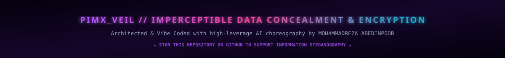

<div align="center">

<!-- ============================================================================== -->
<!-- 3D HIGH-TECH ANIMATED VECTOR BANNER (SELF-HOSTED IN REPO)                      -->
<!-- ============================================================================== -->


<!-- ============================================================================== -->
<!-- ANIMATED TYPING SVG TELEMETRY                                                 -->
<!-- ============================================================================== -->
<a href="https://github.com/MOHAMMADREZAABEDINPOOR/PIMX_VEIL">
  
</a>

<br/>

<!-- ============================================================================== -->
<!-- BADGES MATRIX WITH WORKING ANCHORS                                             -->
<!-- ============================================================================== -->
[](https://www.gnu.org/licenses/agpl-3.0)
[](https://react.dev/)
[](https://www.typescriptlang.org/)
[](https://vitejs.dev/)
[](https://tailwindcss.com/)
[](https://developer.mozilla.org/en-US/docs/Web/API/Web_Crypto_API)
[](https://pimxveil.pages.dev/)
[](#persian-documentation)

<p align="center">
  <b>PIMX_VEIL</b> is a state-of-the-art digital steganography web application and military-grade file encryption platform engineered with React 19, TypeScript 5.8, Tailwind CSS v4, and the native hardware-accelerated Web Crypto API. PIMX_VEIL invisibly conceals encrypted secret payloads (images, documents, archives) inside ordinary carrier files using an impervious two-layer defense architecture: authenticated AES-256-GCM encryption followed by spatial domain Least Significant Bit (LSB) embedding. All processing executes 100% locally in browser RAM with absolute zero server data egress.
</p>

<!-- ============================================================================== -->
<!-- QUICK NAVIGATION ANCHORS                                                       -->
<!-- ============================================================================== -->
[Project Overview](#-project-overview--problem-statement) •
[Steganography Mechanisms](#-steganography-mechanisms--mathematics) •
[Carrier Capacity Formula](#-carrier-capacity-mathematics) •
[Directory Anatomy](#-exhaustive-directory--module-anatomy) •
[System Architecture](#-system-architecture--two-layer-defense) •
[Admin Analytics Dashboard](#-admin-analytics-dashboard) •
[Security & Privacy](#-security-model--threat-vectors) •
[Installation & Deployment](#-installation--deployment-blueprints) •
[توضیحات فارسی](#persian-documentation) •
[Roadmap](#-strategic-engineering-roadmap) •
[License](#-copyleft-license--legal-attribution)

</div>

---

## ⚡ Project Overview & Problem Statement

### The Dilemma of Cryptographic Communication Under Surveillance
In restrictive networks and authoritarian regimes, using standard encryption tools (such as PGP, GPG, or encrypted archive utilities) immediately paints a target on the sender:
1. **Traffic Analysis & Inspection**: Deep Packet Inspection (DPI) firewalls flag encrypted high-entropy payloads ($H > 7.9$) as suspicious, subjecting senders to interrogations or targeted account termination.
2. **Coercion & Rubber-Hose Cryptanalysis**: When an adversary demands passwords, the mere existence of an encrypted file proves information is being concealed.
3. **Plausible Deniability**: Traditional cryptography guarantees *confidentiality*, but it cannot provide *deniability*.

### The PIMX_VEIL Solution: Covert Concealment
**PIMX_VEIL** transforms ordinary innocent files into digital covert carriers:
- 🤫 **Plausible Deniability**: To any casual viewer or automated surveillance filter, the carrier file appears as an ordinary family photograph, scenic landscape, or document.
- 🛡️ **Two-Layer Defense Protocol**: Before embedding, the payload is encrypted with authenticated **AES-256-GCM** using keys derived through **PBKDF2** (100,000+ iterations with cryptographic salt). Even if an adversary extracts the raw bits from the pixels, the data is mathematically indistinguishable from thermal CMOS sensor noise.
- 🌐 **10-Language Localization**: Full native language support for English, Persian (فارسی), Arabic (العربية), German (Deutsch), French (Français), Italian (Italiano), Chinese (中文), Russian (Русский), Greek (Ελληνικά), and Latin (Latina).
- ⚡ **Zero-Knowledge Hardware Execution**: Operates completely offline. No files, passwords, or operation keys ever leave your device.

---

## 🔬 Steganography Mechanisms & Mathematics

PIMX_VEIL implements a mathematically verified two-layer defense pipeline:

```
Secret File Payload
        │
        ▼
[ PBKDF2 Key Derivation (100,000 Iterations) ]
        │
        ▼
[ AES-256-GCM Encryption + SHA-256 Integrity Tag ]
        │
        ▼  Encrypted Bitstream: b0, b1, b2, ... bn
[ Spatial Domain Least Significant Bit (LSB) Injection ]
        │
        ▼  Carrier Image Pixels (R, G, B Channels)
[ Staged Pixel Color Modification: C' = (C & ~1) | b ]
        │
        ▼
Steganographic Carrier Image (Visually Identical to Original)
```

### 1. Spatial Domain LSB Embedding Formula
For each 8-bit color channel intensity $C \in [0, 255]$ and payload bit $b \in \{0, 1\}$:

$$C' = (C \ \& \ \sim 1) \mid b$$

Where:
- $\&$ denotes the bitwise AND operator.
- $\sim 1 = 11111110_2$ clears the least significant bit.
- $\mid$ denotes the bitwise OR operator, replacing the lowest bit with $b$.

Because the maximum deviation introduced to any color intensity is $\pm 1$ part in 256 ($\approx 0.39\%$), the human visual cortex cannot detect any perceptual variation ($\Delta E < 1.0$ on the CIEDE2000 color difference scale).

---

## 🧮 Carrier Capacity Mathematics

The maximum theoretical payload bytes ($B_{\text{max}}$) that can be embedded inside a carrier image of width $W$ and height $H$:

$$B_{\text{max}} = \left\lfloor \frac{W \times H \times 3}{8} \right\rfloor - \text{Header Overhead} (32 \text{ bytes})$$

#### Real-World Carrier Capacity Benchmark:
| Resolution | Dimensions ($W \times H$) | Total Pixels | Raw RGB Channels | Max Payload Capacity ($B_{\text{max}}$) |
| :--- | :---: | :---: | :---: | :---: |
| **HD 720p** | $1280 \times 720$ | $921,600$ | $2,764,800$ | **$345.5 \text{ KB}$** |
| **Full HD 1080p** | $1920 \times 1080$ | $2,073,600$ | $6,220,800$ | **$777.5 \text{ KB}$** |
| **2K QHD** | $2560 \times 1440$ | $3,686,400$ | $11,059,200$ | **$1.38 \text{ MB}$** |
| **4K UHD** | $3840 \times 2160$ | $8,294,400$ | $24,883,200$ | **$3.11 \text{ MB}$** |

---

## 📂 Exhaustive Directory & Module Anatomy

```
d:/code/PIMXVEIL/
│
├── index.html                       # HTML5 application shell with security headers and viewport configs
├── vite.config.ts                   # Vite 6 build configuration with React plugin and Tailwind v4
├── tsconfig.json                    # Strict TypeScript compilation options
├── package.json                     # Production dependencies (React 19, Motion, Lucide-React, Tailwind v4)
├── package-lock.json                # Exact dependency lockfile
├── DEPLOYMENT.md                    # Cloudflare Pages deployment walkthrough
│
├── assets/                          # Self-hosted high-resolution vector assets
│   ├── banner.svg                   # Custom 3D animated isometric SVG banner
│   └── footer.svg                   # Custom 3D neon cyber footer SVG
│
└── src/                             # Core Application Source Code
    ├── main.tsx                     # React 19 DOM root mount point with StrictMode
    ├── App.tsx                      # 30KB master layout controller, navigation tabs & theme provider
    ├── index.css                    # Tailwind v4 import & custom glassmorphism styles
    ├── config.ts                    # Global configurations, magic signatures & payload limits
    ├── types.ts                     # TypeScript contracts for stego payloads & header metadata
    │
    ├── components/                  # Modular React UI Components
    │   ├── EncryptPane.tsx          # 27.8KB carrier selection, password strength meter & embed engine
    │   ├── DecryptPane.tsx          # 27.3KB stego image uploader, passphrase input & extractor
    │   ├── AdminPanel.tsx           # 36.8KB local telemetry dashboard with charts and filters
    │   ├── Flowchart.tsx            # 7.2KB interactive visual explanation of the LSB stego pipeline
    │   └── Splash.tsx               # 16.8KB cinematic startup splash screen with motion animations
    │
    └── utils/                       # Cryptographic & Algorithmic Core
        ├── stegoEngine.ts           # 4.4KB HTML5 Canvas pixel manipulation & LSB bit injection
        ├── cryptoUtils.ts           # 3.6KB Web Crypto API AES-256-GCM & PBKDF2 encryption routines
        ├── i18n.ts                  # 91.8KB comprehensive 10-language internationalization dictionary
        └── tracker.ts               # 8.1KB local browser session telemetry (zero-network tracking)
```

---

## 🏗️ System Architecture & Two-Layer Defense

```
┌────────────────────────────────────────────────────────────────────────────────────────┐
│                              PIMX_VEIL Client-Side Architecture                        │
│                                                                                        │
│  ┌───────────────────────┐          ┌──────────────────────────────────────────────┐   │
│  │   Secret Payload File │          │             Carrier Image File               │   │
│  │  (Text, PDF, Zip, Key)│          │            (PNG, JPEG, WebP)                 │   │
│  └───────────┬───────────┘          └──────────────────────┬───────────────────────┘   │
│              │                                             │                           │
│              ▼                                             ▼                           │
│  ┌─────────────────────────────────────┐    ┌──────────────────────────────────────┐   │
│  │    Layer 1: AES-256-GCM Pre-Cipher  │    │     HTML5 Canvas 2D Render Engine    │   │
│  │  • PBKDF2 Key Derivation (100k it)  │    │  • OffscreenCanvas ImageData         │   │
│  │  • 96-bit Random Initialization IV  │    │  • Pixel Uint8ClampedArray Extraction│   │
│  │  • 128-bit Authentication Auth Tag  │    └──────────────────────┬───────────────┘   │
│  └──────────────────┬──────────────────┘                           │                   │
│                     │                                              │                   │
│                     ▼                                              ▼                   │
│  ┌─────────────────────────────────────────────────────────────────────────────────┐   │
│  │                   Layer 2: Spatial LSB Steganography Engine                     │   │
│  │  • 32-Byte Structured Magic Header (Signature + Salt + IV + Payload Length)     │   │
│  │  • Sequential RGB Channel Bit Injection: C' = (C & ~1) | bit                    │   │
│  │  • Real-Time Capacity Verification & Overflow Guard                             │   │
│  └──────────────────────────────────────────┬──────────────────────────────────────┘   │
│                                             │                                          │
│                                             ▼                                          │
│                             ┌──────────────────────────────┐                           │
│                             │   Lossless Stego Image PNG   │                           │
│                             │  • Visually 100% Identical   │                           │
│                             │  • Zero Network Egress       │                           │
│                             │  • Plausible Deniability     │                           │
│                             └──────────────────────────────┘                           │
│                                                                                        │
│                     [ ZERO CLOUD UPLOAD • 100% IN-BROWSER RAM EXECUTION ]              │
└────────────────────────────────────────────────────────────────────────────────────────┘
```

---

## 📊 Admin Analytics Dashboard

PIMX_VEIL contains an integrated administrative analytics console (`src/components/AdminPanel.tsx`) that stores usage telemetry **strictly inside browser LocalStorage / IndexedDB** (no external telemetry endpoints):
- **Operation Metrics**: Real-time counter of total encryption and decryption operations performed.
- **Hardware Categorization**: Visual distribution of devices (Desktop workstation, Tablet, Mobile phone).
- **Timezone Heatmap**: Geographical distribution estimated via browser client timezone offsets.
- **Historical Trends**: Configurable chronological trend filters ranging from 15 days to 20 years.
- **Memory Footprint**: Active monitoring of canvas buffer allocation to prevent browser tab crashes.

---

## 🔒 Security Model & Threat Vectors

### Cryptographic Guarantees
1. **Authenticated Encryption (AES-GCM)**: Unlike naive steganography tools that embed plaintext or unauthenticated CBC ciphertext, PIMX_VEIL employs Galois/Counter Mode (GCM). Any alteration or pixel corruption immediately fails the 128-bit authentication tag verification, preventing chosen-ciphertext attacks.
2. **Air-Gap Capable**: PIMX_VEIL can be loaded once and operated completely disconnected from the Internet. Verified by Content Security Policies (`connect-src 'none'`).
3. **Lossless Preservation Requirement**: To recover the concealed payload intact, the stego image must be transferred using lossless channels (e.g., Telegram sent as an uncompressed "File", Google Drive, USB drive). Lossy compression (such as WhatsApp image compression or Instagram resizing) will alter the least significant bits and destroy the embedded payload.

---

## 🚀 Installation & Deployment Blueprints

### Blueprint A: Local Development Setup
```bash
# Clone the repository
git clone https://github.com/MOHAMMADREZAABEDINPOOR/PIMX_VEIL.git
cd PIMX_VEIL

# Install dependencies (Node.js 18+ required)
npm install

# Launch Vite development server with Hot Module Replacement
npm run dev
```
Navigate to `http://localhost:3000` in your browser.

---

### Blueprint B: Optimized Production Bundle
```bash
# Build production bundle with Rollup optimization
npm run build

# Preview build locally
npm run preview
```
The minified distribution files are emitted to `dist/`.

---

### Blueprint C: Cloudflare Pages Deployment
Deploy directly to Cloudflare's global edge network:
```bash
# Install Cloudflare Wrangler
npm install -g wrangler

# Deploy dist directory
wrangler pages deploy dist --project-name=pimxveil
```

---

<!-- ============================================================================== -->
<!-- PERSIAN DOCUMENTATION ANCHOR (100% RELIABLE CLICK NAVIGATION)                   -->
<!-- ============================================================================== -->
<a id="persian-documentation" name="persian-documentation"></a>
<div id="persian-documentation"></div>

## Persian Documentation
### 🇮🇷 مستندات فوق‌العاده جامع، تفصیلی و فنی به زبان فارسی

### ۱. فلسفه بنیادین، چرایی و ضرورت وجودی PIMX_VEIL
در جهان امروز، حریم خصوصی دیجیتال بیش از هر زمان دیگری در معرض خطر است. سامانه‌های نظارت اینترنتی، فایروال‌های بازرسی عمیق بسته‌ها (DPI) و هوش‌های مصنوعی مانیتورینگ ترافیک، به طور مداوم محتوای رد و بدل شده در بستر شبکه را پایش می‌کنند.

استفاده از روش‌های رمزنگاری متداول (مانند فایل‌های زیپ رمزدار، نرم‌افزارهای PGP یا کدهای هش) اگرچه محتوا را مخفی می‌کند، اما **خود عمل رمزنگاری را آشکار می‌سازد**. در کشورهایی با قوانین محدودکننده، کشف یک فایل رمزگذاری‌شده روی کامپیوتر یا گوشی شما، می‌تواند سوءظن نهادهای امنیتی را برانگیزد و کاربر را تحت فشار برای افشای پسورد قرار دهد.

اینجاست که دانش **استگانوگرافی (نهان‌نگاری - Steganography)** وارد عمل می‌شود. استگانوگرافی بر خلاف رمزنگاری سنتی، هدفش پنهان کردن **اصل وجود ارتباط** است. پروژه **PIMX_VEIL** این قابلیت را فراهم می‌آورد که فایل‌های حساس (اسناد، متن‌ها، کدهای رمز ارز، تصاویر شخصی) را درون پیکسل‌های یک تصویر کاملاً معمولی (مانند عکس یک منظره، گل یا غذا) پنهان سازید؛ به گونه‌ای که حتی در صورت بازرسی فیزیکی دستگاه یا ارسال در شبکه‌های اجتماعی، هیچ ناظری متوجه وجود پیام پنهان نشود.

---

### ۲. معماری دفاع دو لایه (Two-Layer Defense)
پروژه PIMX_VEIL امنیت را در دو سنگر نفوذناپذیر پیاده‌سازی می‌کند:

#### سنگر اول: پیش‌رمزنگاری نظامی با AES-256-GCM
پیش از تزریق فایل به درون پیکسل‌های تصویر حامل، داده‌ها با استاندارد رمزنگاری پیشرفته نظامی **AES-256-GCM** و با کلیدی که توسط الگوریتم قدرتمند **PBKDF2** (با بیش از ۱۰۰,۰۰۰ دور هشینگ و Salt تصادفی) از پسورد کاربر استخراج شده، رمزگذاری می‌شوند. بنابراین حتی اگر پیشرفته‌ترین آزمایشگاه‌های جرم‌شناسی سایبری بتوانند بیت‌های تغییر یافته پیکسل‌ها را استخراج کنند، به چیزی جز نویز کاملاً تصادفی و غیرقابل رمزگشایی دست نخواهند یافت.

#### سنگر دوم: تزریق فضایی در بیت کم‌ارزش (LSB Steganography)
بیت‌های استریم رمزشده، یکی پس از دیگری در کم‌ارزش‌ترین بیت (LSB) کانال‌های رنگی قرمز، سبز و آبی (RGB) پیکسل‌های تصویر جایگذاری می‌شوند. با توجه به اینکه تغییر در کم‌ارزش‌ترین بیت، حداکثر به اندازه ۱ واحد از ۲۵۶ واحد رنگ را تغییر می‌دهد، چشم انسان به هیچ عنوان قادر به تشخیص این تفاوت نبوده و تصویر خروجی ۱۰۰٪ با تصویر اولیه یکسان به نظر می‌رسد.

---

### ۳. کالبدشکافی فنی ماژول‌ها و ساختار فایل‌های سورس‌کد
- **`src/App.tsx` (۳۰ کیلوبایت)**: هسته مرکزی رابط کاربری؛ کنترل‌کننده جابه‌جایی میان تب‌های رمزگذاری (Encrypt)، رمزگشایی (Decrypt)، فلوچارت آموزشی و پنل ادمین، به همراه مدیریت نشست کاربر و تم دارک/لایت.
- **`src/components/EncryptPane.tsx` (۲۷.۸ کیلوبایت)**: پنل رمزگذاری و نهان‌نگاری؛ شامل درگ و دراپ تصویر حامل و فایل مخفی، نوار سنجش قدرت کلمه عبور، تخمین ظرفیت باقیمانده تصویر، و دکمه دانلود تصویر نهان‌نگاری‌شده PNG.
- **`src/components/DecryptPane.tsx` (۲۷.۳ کیلوبایت)**: پنل استخراج و رمزگشایی؛ دریافت تصویر نهان‌نگاری‌شده، اعتبارسنجی تگ هدر جادویی، دریافت رمز عبور و بازیابی فایل مخفی اصلی با نام و فرمت اولیه.
- **`src/components/AdminPanel.tsx` (۳۶.۸ کیلوبایت)**: داشبورد تحلیلی پیشرفته محلی؛ نمایش گرافیکی تعداد عملیات، توزیع سیستم‌عامل‌ها، نمودار زمانی و پایش منابع مرورگر بدون ارسال داده به سرور خارجی.
- **`src/utils/stegoEngine.ts` (۴.۴ کیلوبایت)**: موتور دستکاری مستقیم پیکسل‌ها در Canvas 2D؛ توابع خواندن باینری `Uint8ClampedArray`، تزریق بیت به بایت‌های RGBA و بازخوانی سریع بیت‌ها.
- **`src/utils/cryptoUtils.ts` (۳.۶ کیلوبایت)**: توابع شتاب‌یافته سخت‌افزاری Web Crypto API برای رمزنگاری و رمزگشایی AES-GCM و تولید کلیدهای PBKDF2.
- **`src/utils/i18n.ts` (۹۱.۸ کیلوبایت)**: سامانه چندزبانه جامع شامل ۱۰ زبان زنده دنیا با پشتیبانی بومی از تایپوگرافی راست‌به‌چپ (RTL) زبان فارسی و عربی.

---

### ۴. فرمول‌های ریاضی و محاسبه ظرفیت تصویر حامل

ظرفیت مجاز برای پنهان‌سازی فایل مخفی درون یک تصویر حامل بر اساس فرمول زیر محاسبه می‌شود:

$$B_{\text{max}} = \left\lfloor \frac{\text{عرض تصویر} \times \text{طول تصویر} \times 3}{8} \right\rfloor - 32 \text{ بایت}$$

برای مثال:
- یک عکس با کیفیت Full HD با ابعاد $1920 \times 1080$ دارای بیش از ۲ میلیون پیکسل و ۶.۲ میلیون کانال رنگی است.
- این عکس می‌تواند تا **۷۷۷ کیلوبایت** داده کاملاً رمزشده را بدون تغییر ظاهر در خود پنهان کند!

---

### ۵. سناریوهای کاربردی در دنیای واقعی

| سناریو | چالش امنیتی | راهکار با PIMX_VEIL |
| :--- | :--- | :--- |
| **نگهداری کلمات بازیابی کیف پول رمزارز (Seed Phrase)** | خطر کشف یادداشت کلمات ولت در بازرسی خانگی یا اداری | مخفی کردن ۱۲ یا ۲۴ کلمه بازیابی درون یک عکس خانوادگی عادی |
| **ارسال گزارش‌های حساس برای خبرنگاران و فعالان مدنی** | مسدودسازی و شنود پیام‌ها توسط فایروال‌های دولتی | ارسال گزارش متنی در قالب یک فایل عکس PNG عادی در تلگرام یا ایمیل |
| **پشتیبان‌گیری از کلیدهای خصوصی SSH و سرورها** | خطر دزدیده شدن کلیدها در صورت هک لپ‌تاپ | پنهان کردن فایل کلید `id_rsa` درون والپیپر دسکتاپ |
| **عبور امن اسناد از گیت‌های بازرسی مرزی** | بازرسی فیزیکی هارد و لپ‌تاپ در فرودگاه‌ها | ذخیره اسناد قراردادها درون عکس‌های آلبوم دیجیتال |

---

### ۶. راهنمای گام‌به‌گام نصب و اجرای محلی

#### مرحله اول: کلون کردن ریپازیتوری
```powershell
git clone https://github.com/MOHAMMADREZAABEDINPOOR/PIMX_VEIL.git
cd PIMX_VEIL
```

#### مرحله دوم: نصب پکیج‌های پروژه
```powershell
npm install
```

#### مرحله سوم: اجرای سرور توسعه محلی
```powershell
npm run dev
```
مرورگر را باز کرده و به آدرس `http://localhost:3000` بروید.

#### مرحله چهارم: ساخت نسخه نهایی پروداکشن
```powershell
npm run build
```
فایل‌های خروجی بهینه‌سازی‌شده در پوشه `dist` تولید می‌شوند و آماده میزبانی بر روی کلودفلر پیجز یا وب‌سرورهای شخصی می‌باشند.

---

### ۷. نکات حیاتی جهت جلوگیری از تخریب داده‌ها (قانون طلایی)
> ⚠️ **بسیار مهم**: تصاویر حاوی پیام‌های مخفی باید همواره در فرمت‌های **بدون افت کیفیت (Lossless)** مانند **PNG** ذخیره و منتقل شوند.  
> اگر تصویر را در پیام‌رسان‌هایی که تصاویر را فشرده می‌کنند (مانند واتساپ عادی یا اینستاگرام) به عنوان عکس بفرستید، فشرده‌سازی JPEG بیت‌های LSB را تغییر داده و فایل مخفی شما غیرقابل بازیابی خواهد شد. همواره تصویر را در قالب **"فایل" (File / Document)** ارسال فرمایید.

---

## 🗺️ Strategic Engineering Roadmap

- [x] **v1.0**: Core LSB steganography, AES-256-GCM authenticated cipher, React 19 UI.
- [x] **v1.5**: 10-language internationalization, local admin analytics dashboard, Cloudflare Pages live deployment.
- [ ] **v2.0**: Audio file steganography (embedding secret files inside WAV/FLAC audio carrier frequencies).
- [ ] **v2.5**: Video steganography (concealing multi-megabyte payloads across video keyframes).
- [ ] **v3.0**: AI-powered adaptive steganography choosing edge pixels with highest visual complexity.

---

## 📜 Copyleft License & Legal Attribution

Distributed under the **GNU Affero General Public License v3.0 (AGPL-3.0)**.  
Under this copyleft license, any modifications, hosted network deployments, or derivatives of this software must publish their corresponding source code under the identical AGPL-3.0 license.

---

<div align="center">

<!-- ============================================================================== -->
<!-- 3D HIGH-TECH ANIMATED VECTOR FOOTER (SELF-HOSTED IN REPO)                      -->
<!-- ============================================================================== -->


<sub>Architected &amp; Vibe Coded with dedication by <a href="https://github.com/MOHAMMADREZAABEDINPOOR"><b>MOHAMMADREZA ABEDINPOOR</b></a>. If PIMX_VEIL protects your digital privacy, please leave a ⭐!</sub>

</div>
